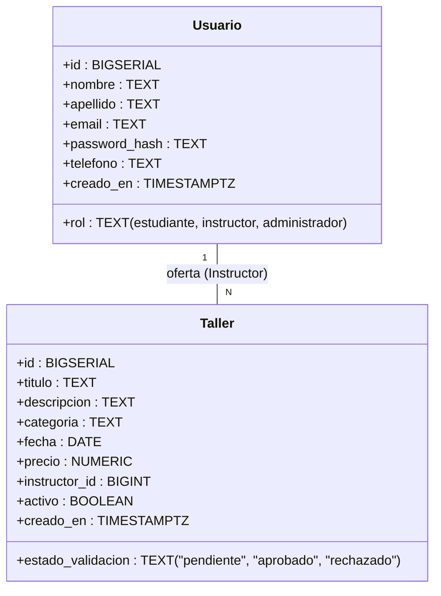

# Entrega del Sprint 2 – Gestión de Productos/Servicios

## 1. Modelo de Datos Actualizado

Se actualizó la tabla principal `talleres` (que actúa como los "productos/servicios" de la plataforma LearnUp) para incluir la trazabilidad de validación requerida.



**Nota Técnica**: Se agregó una restricción a nivel de base de datos (`CHECK estado_validacion IN ('pendiente', 'aprobado', 'rechazado')`) asegurando la consistencia de los datos independientemente de la API.

---

## 2. Historias de Usuario (Backlog del Sprint)

### HU-01: Registro de Producto/Servicio (Ofertante)
- **Como** Ofertante (Instructor).
- **Quiero** registrar un producto o servicio con sus detalles básicos.
- **Para que** pueda ser visible en la plataforma.
- **Criterios de Aceptación:**
  - Al registrar exitosamente, el estado inicial en la BD debe ser "Pendiente".
  - Solo los usuarios con rol `instructor` o `administrador` pueden crear.

### HU-02: Edición o Eliminación de Producto/Servicio (Ofertante)
- **Como** Ofertante (Instructor).
- **Quiero** modificar los datos de un producto o servicio existente.
- **Para que** mantener actualizada mi oferta.
- **Criterios de Aceptación:**
  - Cualquier actualización a los atributos de un taller debe devolver su estado automáticamente a "Pendiente".
  - Se debe notificar al usuario de este efecto secundario en la interfaz.

### HU-03: Validación de Contenido (Administrador)
- **Como** Administrador.
- **Quiero** revisar los productos/servicios en estado "Pendiente".
- **Para que** garantice la calidad de la plataforma, aprobándolos o rechazándolos antes de que sean visibles.
- **Criterios de Aceptación:**
  - Existencia de un panel exclusivo para el administrador (`GET /api/talleres/pendientes`).
  - Capacidad de enviar un PATCH para cambiar el estado a "Aprobado" o "Rechazado".
  - Los Demandantes (Estudiantes) solo deben poder visualizar talleres cuyo estado sea estrictamente "Aprobado" en la ruta `GET /api/talleres`.

---

## 3. Especificaciones de Comportamiento (Enfoque SDD)

Las especificaciones de prueba se han implementado usando el framework **Jest** junto con **Supertest** para la API de Node.js, aislando la lógica de Supabase mediante Mocks.

A continuación, los extractos de la suite de pruebas (`test/talleres.spec.js`) que garantizan el cumplimiento de las HU:

```javascript
describe('Sprint 2: Gestión de Productos/Servicios (SDD)', () => {
  
  describe('HU-01: Registro de Producto/Servicio (Ofertante)', () => {
    it('Debe crear un taller con estado inicial "pendiente"', async () => {
      const res = await request(app).post('/api/talleres').send({ titulo: 'Curso', ... });
      expect(res.statusCode).toBe(201);
      expect(res.body.taller.estado_validacion).toBe('pendiente');
    });
  });

  describe('HU-02: Edición de Producto/Servicio (Ofertante)', () => {
    it('Cualquier edición debe devolver el estado a "pendiente"', async () => {
      const res = await request(app).put('/api/talleres/10').send({ titulo: 'Editado' });
      expect(res.statusCode).toBe(200);
      expect(res.body.taller.estado_validacion).toBe('pendiente');
    });
  });

  describe('HU-03: Validación de Contenido (Administrador)', () => {
    it('El administrador debe poder aprobar un taller pendiente', async () => {
      const res = await request(app).patch('/api/talleres/10/validacion').send({ estado_validacion: 'aprobado' });
      expect(res.statusCode).toBe(200);
      expect(res.body.taller.estado_validacion).toBe('aprobado');
    });
  });

  describe('Exploración y Visibilidad (Demandante)', () => {
    it('Solo los talleres "aprobados" deben ser listados en la vista pública', async () => {
      const res = await request(app).get('/api/talleres');
      // Verificación interna de query 'eq' aprobado.
      expect(res.statusCode).toBe(200);
    });
  });
});
```

---

## 4. Evidencia de Ejecución 

*(Añadir aquí las siguientes capturas de pantalla)*

1. **Captura 1 (Consola/Terminal)**: Mostrar la ejecución exitosa del comando `npm test` donde todos los casos de SDD se muestran en verde ("PASS").
2. **Captura 2 (Frontend Ofertante)**: Mostrar la interfaz del instructor al crear o editar un taller donde dice "Pendiente".
3. **Captura 3 (Frontend Admin)**: Mostrar la nueva pantalla de "Validar Talleres" que usa el Administrador.

---

## 5. URL de Producción (Render)

**Enlace Público de la Aplicación:** `https://learnup-web-xxxx.onrender.com` 
*(Asegúrate de pegar aquí el enlace real de Render de tu frontend).*
